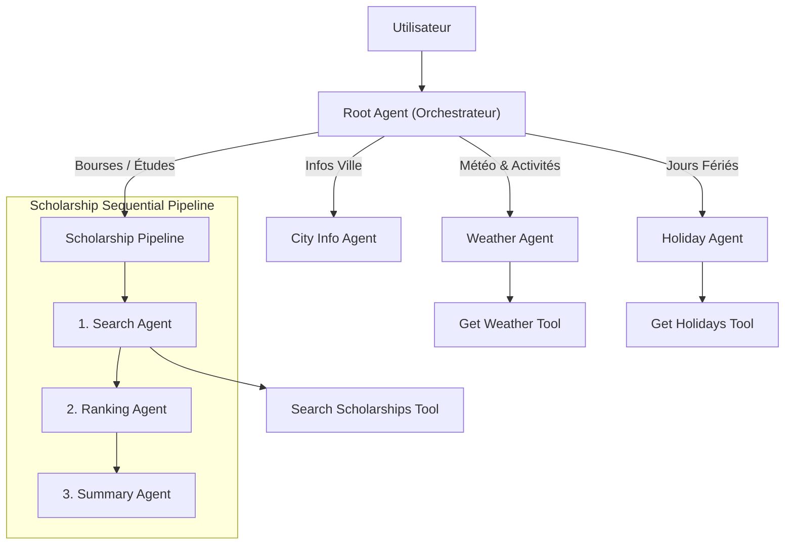
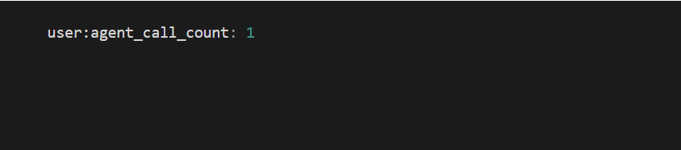
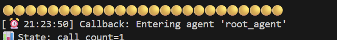
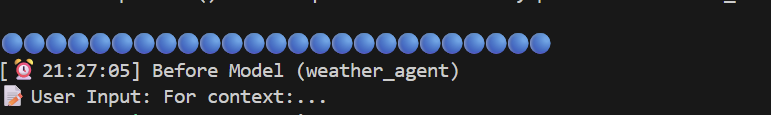
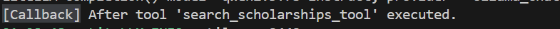
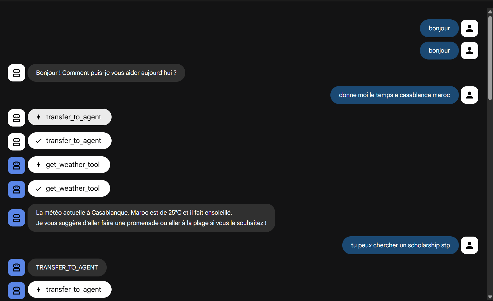
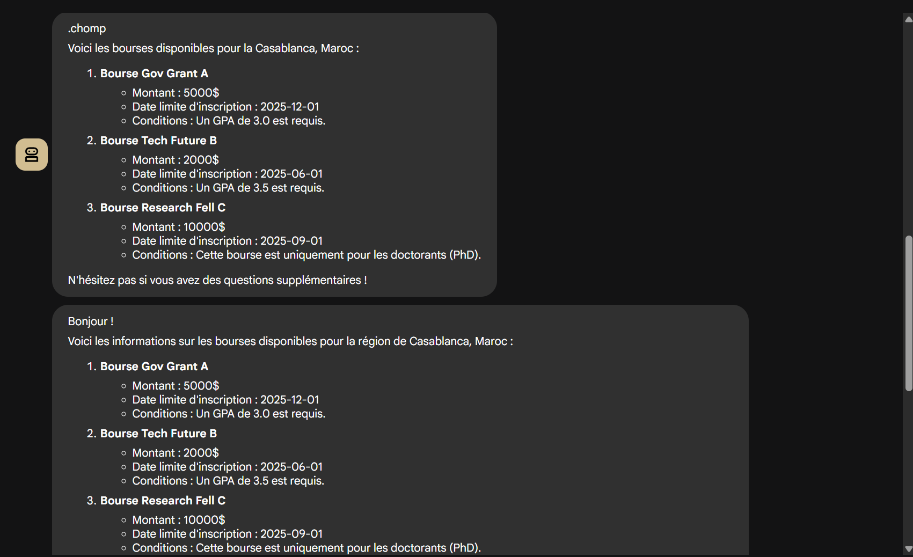

# 🌍 Salah Agent - Salah Travel & Study System

Bienvenue dans le projet **Salah Agent**, un assistant IA multi-agents intelligent conçu pour aider les utilisateurs dans deux domaines principaux : **le voyage** (météo, activités, culture) et **les études à l'étranger** (recherche de bourses, classement, conseils).

Ce projet utilise l'architecture **Google ADK** (Agent Development Kit) pour orchestrer plusieurs agents spécialisés via un agent racine (Router).

---

## 🏗️ Architecture du Système Multi-Agent

Le système repose sur une architecture hiérarchique avec un **Root Agent** qui agit comme un routeur intelligent. Il analyse l'intention de l'utilisateur et délègue la tâche à l'agent ou au pipeline approprié.

*(Illustration de l'architecture globale)*

### Diagramme de flux

### Description des Agents

1.  **Root Agent** : Cerveau du système. Il ne traite pas les requêtes lui-même mais les route vers les experts.
2.  **Weather Agent** : Utilise `open-meteo` pour donner la météo et suggérer des activités en fonction des conditions (ex: musée si pluie, plage si soleil).
3.  **Holiday Agent** : Donne les jours fériés pour un pays donné.
4.  **City Info Agent** : Guide touristique culturel (LLM pur).
5.  **Scholarship Pipeline** : Un **agent séquentiel** complexe pour les bourses d'études.

---

## 🔄 State Management (Gestion d'État)

L'une des forces de ce projet est l'utilisation avancée du **State Management** pour faire passer des données complexes entre des agents autonomes.

Au lieu de passer tout le contexte en texte brut, les agents lisent et écrivent dans un état partagé (`session.state`).

*(Exemple de State Management)*

---

## 📡 Callbacks & Monitoring

Le système implémente des **Callbacks** (hooks) pour surveiller, logger et modifier le comportement des agents en temps réel sans toucher à leur logique interne.

### Types de Callbacks utilisés :

1.  **`before_agent_callback` (Global)** :
    *   **Fonction** : `check_and_log_agent_entry`
    *   **Rôle** : Se déclenche *avant* qu'un agent ne commence.
    *   **Usage** :
        *   Log l'heure et le nom de l'agent (`[⏰ HH:MM:SS] Entering agent...`).
        *   Incrémente un compteur d'appels dans le state (`user:agent_call_count`).
        *   Peut **annuler/skipper** l'exécution si une flag `skip_processing` est active.
        
    

2.  **`before_model_callback` (Weather Agent)** :
    *   **Fonction** : `simple_before_model_modifier`
    *   **Rôle** : Se déclenche *juste avant* d'envoyer le prompt au LLM.
    *   **Usage** : Inspecte la dernière requête utilisateur pour le debugging.
    
    

3.  **`after_tool_callback` (Search Agent)** :
    *   **Fonction** : `simple_after_tool_modifier`
    *   **Rôle** : Se déclenche *après* l'exécution d'un outil.
    *   **Usage** : Vérifie que l'outil a bien renvoyé des données valides avant que l'agent ne continue.
    
    

---

## 📸 Aperçu du Projet

Voici quelques captures d'écran illustrant le fonctionnement du système :

| Météo & Activités | Recherche de Bourses |
|-------------------|----------------------|
|  |  |

*(Les images ci-dessus montrent les réponses générées par les différents agents)*

---
### Exemples de requêtes

*   *"Quel temps fait-il à Paris ?"* (Weather Agent)
*   *"Je cherche une bourse pour un Master en France."* (Scholarship Pipeline)
*   *"Donne-moi les jours fériés au Maroc."* (Holiday Agent)
